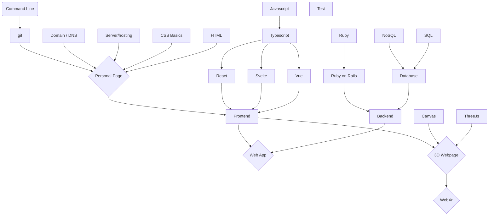

```mermaid
flowchart TD
    A(Command Line) --> git

    git --> F{Personal Page}

    J[Domain / DNS] --> F
    K[Server/hosting] -->F
    C[CSS Basics] --> F
    D[HTML] --> F


    F --> Frontend

    WA{Web App}


    Ruby --> RoR[Ruby on Rails]
    RoR --> Backend


    Frontend --> WA
    Backend --> WA


    Javascript --> Typescript
    Typescript --> React
    Typescript --> Svelte
    Typescript --> Vue

    React --> Frontend
    Svelte --> Frontend
    Vue --> Frontend

    Test


    NoSQL --> Database
    SQL -->Database
    Database --> Backend

    Frontend --> 3D{3D Webpage}
    Canvas --> 3D
    ThreeJs -->3D

    3D -->XR{WebXr}
```